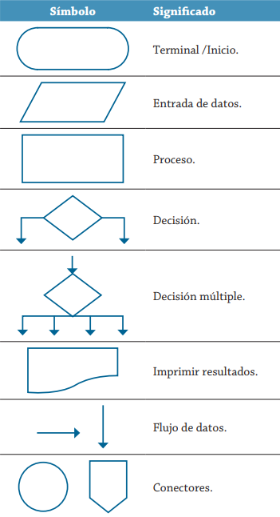
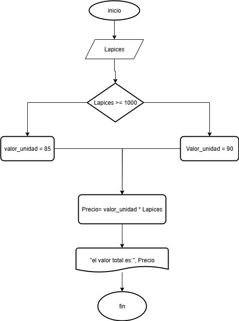

# Pseudocódigo


## Diagrama de flujo

el óvalo o terminal para indicar el inicio o fin, el rectángulo o proceso para indicar una acción o proceso, el diamante o decisión para mostrar un punto de bifurcación, y el paralelogramo o entrada/salida para datos que entran o salen del sistema





# Ejercicio 2
Ingreso total semestral

## solución 
### pseudocódigo
```
inicio
leer ID, S1, S2, S3, S4, S5, S6
Total = S1 + S2 + S3 + S4 + S5 + S6
promedio = Total/6
Escribir ID, total, promedio
fin
 ```
 ## diagrama de flujo
 


## Actividad de tarea

```
inicio
leer Nota_1, Nota_2, Nota_3, Nota_4, Nota_5, Nota_6
Total = Nota_1 + Nota_2 + Nota_3 + Nota_4 + Nota_5 + Nota_6
promedio = Total/6
nota_calculada = promedio × 0.7
Nota_necesaria = (3.0 - nota_calculada)/0.3
Si Nota_necesaria > 5.0 entonces
   Escribir "No es posible alcanzar 3.0, necesitas más de 5.0"
Sino si Nota_necesaria < 0 entonces
   Escribir "Ya tienes más de 3.0, no necesitas nota en el final"
Sino
   Escribir "Necesitas sacar", Nota_necesaria, "en la nota final para pasar con 3.0"
Fin si
fin

 ```


## Ejercicio de clase 2

cuánto se debe pagar por equis cantidad de lápices considerando que si son 1000 o más el costo es de $85 cada uno; de lo contrario, el precio es de $90.


|variables| tipo | comentario|
|----------|-----|------------|
Lapices| entrada| cantidad de lapices
precio | salida| precio total de los lapices
valor_unidad| intermedia| valor unitario de cada lapiz
85, 90| constantes|no cambian

```
leer lapices
 Si lapices >= 1000:
     valor_unidad = 85
 Si no 
     valor_unidad = 90
fin Si

Precio = Lapices * valor_unidad
escribir "El valor es:", Precio

Fin

``` 





## Actividad 3
Un almacén de ropa tiene una promoción: por compras superiores a $250 000 se les aplicará un descuento de 15%, de caso contrario, sólo se aplicará un 8% de descuento. Realice un algoritmo para determinar el precio final que debe pagar una persona por comprar en dicho almacén y de cuánto es el descuento que obtendrá. 

|variables |Tipo |Comentario |
|----------|-----|-----------|
total_compra|entrada|valor de la compra
descuento|salida|descuento segun el valor de la compra
precio_final|salida|valor a pagar|
15% 8% $250000|

### pseudocodigo
  
```
inicio
leer

```


## ejercicio 5
El director de una escuela está organizando un viaje de estudios, y requiere determinar cuánto debe cobrar a cada alumno y cuánto debe pagar a la compañía de viajes por el servicio. La forma de cobrar es la siguiente: si son 100 alumnos o más, el costo por cada alumno es de $65.00; de 50 a 99 alumnos, el costo es de $70.00, de 30 a 49, de $95.00, y si son menos de 30, el costo de la renta del autobús es de $4000.00, sin importar el número de alumnos.

|variables |Tipo |Comentario |
|----------|-----|-----------|
alumnos| entrada|cantidad de alumnos
costo-alumno| salida|costo individual por alumno
costo-total| salida|el valor total 
100, 50-99, 30-49| constantes|# de alumnos

```
inicio
leer alumnos
  Si alumnos >= 100:
       costo_alumno = 65
  Si no 
      si alumnos >= 50:
          costo_alumno = 70
      si no 
         si alumnos >= 30:
            costo_alumno = 95
         si no 
           costo_total= 4000
           costo_alumno= costo_total/alumnos
         fin si
      fin si
  fin si
  costo_total= costo_alumno * alumnos
  escribir costo_total, costo_alumno
      


